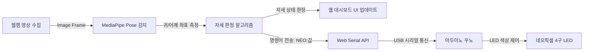
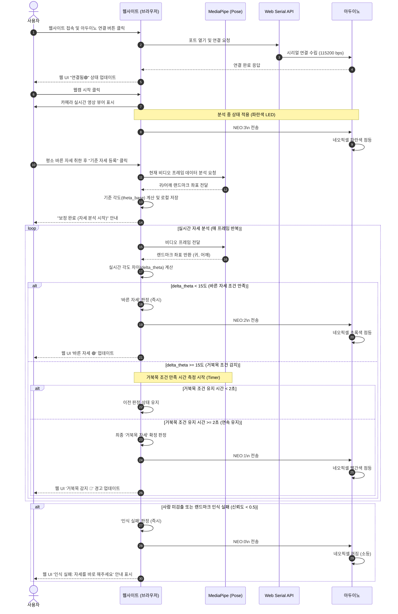

# [PRD] 바른 자세 코치 웹사이트 (Posture Coach)

본 문서는 웹캠 영상을 기반으로 사용자의 자세(바른 자세 / 거북목 자세)를 실시간으로 분석하고, 그 결과를 웹페이지와 아두이노의 네오픽셀(NeoPixel) LED로 시각화하여 알려주는 **'바른 자세 코치 웹사이트'**의 제품 요구사항 정의서(PRD)입니다. 초보 개발자나 하드웨어 입문자도 쉽게 이해하고 구현할 수 있도록 작성되었습니다.

---

## 1. 프로젝트 개요 (Overview)

### 1.1 배경 및 목적
현대인들은 컴퓨터와 스마트폰의 장시간 사용으로 인해 거북목 증후군(Forward Head Posture) 및 자세 불균형을 겪기 쉽습니다. 본 프로젝트는 별도의 웨어러블 장비 없이 **일반 웹캠**과 **아두이노 실물 LED(네오픽셀)**만을 활용해 사용자가 스스로 자세를 모니터링하고 교정할 수 있도록 돕는 실시간 IoT 피드백 시스템을 구축하는 것을 목적으로 합니다.

### 1.2 시스템 아키텍처

### 1.3 전체 연동 시퀀스 다이어그램 (Sequence Diagram)
아래 시퀀스 다이어그램은 사용자 동작에 따른 웹 브라우저, MediaPipe, Web Serial API, 아두이노 간의 실시간 이벤트 흐름 및 데이터 송수신 과정을 보여줍니다.

### 1.4 상세 동작 프로세스
1. **커넥션 형성**: 사용자는 웹에 접속해 USB로 연결된 아두이노 보드와 Web Serial API 통신을 개시합니다.
2. **카메라 구동 및 상태 동기화**: 카메라가 켜지면 분석 준비 상태를 표시하기 위해 아두이노에 `NEO:3\n` 명령을 보내 네오픽셀을 파란색으로 켭니다.
3. **사용자 자세 보정(Calibration)**: 사용자가 바른 자세 상태를 등록하여 고유한 신체 각도($\theta_{base}$)를 측정합니다.
4. **루프 분석**: MediaPipe가 프레임별로 사용자 얼굴 측면(귀)과 어깨의 각도를 실시간 추출하고, 저장된 보정 각도와의 차이를 모니터링합니다.
5. **피드백 전송**: 
   * 바른 자세는 인디케이터에 녹색등(`NEO:2\n`)으로 즉시 동기화됩니다.
   * 거북목 자세의 경우 일시적인 굽힘에 따른 피드백 오작동을 막기 위해 브라우저에서 자체 타이머로 2초 지속 여부를 감시한 뒤, 기준 돌파 시 빨간색 경고등(`NEO:1\n`)을 보냅니다.
   * 프레임 안에서 사용자가 이탈하거나 탐지가 불가능한 예외 케이스 발생 시, LED를 모두 소등(`NEO:0\n`)해 통신 안정성을 높입니다.

---

## 2. 하드웨어 구성 및 사양

### 2.1 하드웨어 부품 리스트
*   **아두이노 우노 (Arduino Uno)**: 메인 컨트롤러
*   **네오픽셀 LED 스트립/링 (NeoPixel)**: 4구 구성, 아두이노 **디지털 7번 핀**에 연결
*   **PC 및 웹캠**: 웹 브라우저 실행 및 영상 입력용

### 2.2 아두이노 범용 펌웨어 정보
*   **적용 펌웨어**: `web_serial_firmware.ino` (수정 없이 그대로 사용)
*   **네오픽셀 통신 사양**:
    *   통신 속도(Baud Rate): `115200 bps`
    *   종단 문자(Delimiter): `\n` (줄바꿈 문자)
    *   네오픽셀 제어 명령 프로토콜: `NEO:값\n`
*   **네오픽셀 상태별 명령 매핑**:

| 상태 | 전송 명령어 (String) | 네오픽셀 LED 동작 | 비고 |
| :--- | :--- | :--- | :--- |
| **자세 분석 중** | `NEO:3\n` | **파란색 (Blue)** | 웹캠이 켜지고 자세를 분석하기 시작할 때 |
| **바른 자세** | `NEO:2\n` | **초록색 (Green)** | 정상 범위 내의 자세로 판정될 때 |
| **거북목 자세** | `NEO:1\n` | **빨간색 (Red)** | 거북목 조건(15도 이상)이 연속 2초 이상 지속적으로 충족될 때 |
| **감지 실패 / 대기** | `NEO:0\n` (또는 기타 값) | **LED 꺼짐 (Off)** | 카메라에 사람이 없거나 랜드마크 감지 실패 시 |

---

## 3. 웹 애플리케이션 주요 기능 요구사항 (Functional Requirements)

### 3.1 웹캠 제어 및 화면 표시
*   **웹캠 시작/종료 버튼**: 
    *   사용자가 웹캠 작동을 제어할 수 있는 직관적인 토글 또는 개별 버튼을 제공합니다.
    *   웹 브라우저의 카메라 권한 승인 요청 처리가 포함되어야 합니다.
*   **실시간 웹캠 뷰어**:
    *   웹캠 영상을 화면에 실시간으로 표시합니다.
    *   MediaPipe Pose가 추출한 신체 랜드마크(점과 선)를 영상 위에 캔버스(Canvas)로 겹쳐서(Overlay) 시각화합니다.

### 3.2 아두이노 연결 및 상태 관리
*   **아두이노 연결/연결 해제 버튼**:
    *   Web Serial API를 사용하여 브라우저와 아두이노 간의 시리얼 포트 연결을 수립/해제합니다.
*   **연결 상태 인디케이터**:
    *   현재 시리얼 통신 연결 상태를 웹 UI 상에 시각적으로 표시합니다. (예: `연결됨`🟢 / `연결 안 됨`🔴)
*   **통신 오류 안내**:
    *   시리얼 포트가 중간에 뽑히거나 데이터 송수신에 실패할 경우, 경고 메시지 창(모달 또는 토스트 알림)을 통해 사용자에게 안내합니다.

### 3.3 실시간 자세 분석 및 판정 알고리즘
*   **랜드마크 추출**:
    *   MediaPipe Pose 모델을 사용하여 측면 자세 분석에 필요한 핵심 좌표를 추출합니다.
    *   **핵심 랜드마크**:
        *   **귀 (Ear)**: 왼쪽 귀(Landmark 7) 또는 오른쪽 귀(Landmark 8)
        *   **어깨 (Shoulder)**: 왼쪽 어깨(Landmark 11) 또는 오른쪽 어깨(Landmark 12)
    *   *Tip: 사용자가 카메라를 향해 서 있는 방향(왼쪽 옆모습 또는 오른쪽 옆모습)을 웹캠 영상에서 자동으로 판단하거나 사용자가 선택할 수 있도록 하여, 더 가시성이 높은 쪽의 랜드마크(왼쪽 또는 오른쪽)를 선택해 계산합니다.*

*   **사용자 맞춤형 자세 보정(Calibration) 기반 판정 알고리즘**:
    *   **기준 자세 등록 (Calibration)**:
        *   사용자가 바른 자세를 취한 상태에서 `기준 자세 등록` 버튼을 누르면, 그 순간의 귀 좌표 $P_{ear}$와 어깨 좌표 $P_{shoulder}$를 통해 **기준 각도 $\theta_{base}$**를 계산하고 저장합니다.
        *   $$\theta_{base} = \arctan2(|x_1 - x_2|, |y_2 - y_1|) \times \left(\frac{180}{\pi}\right)$$
        *   기준 자세가 등록되기 전까지는 시스템은 **기본 고정값 $\theta_{base} = 0^\circ$** (수직 상태)를 기준으로 동작하거나, '보정 필요' 상태를 유지합니다.
    *   **실시간 각도 변화량 계산 ($\Delta\theta$)**:
        *   프레임마다 측정되는 실시간 각도 $\theta_{current}$와 저장된 $\theta_{base}$의 차이를 구합니다.
        *   $$\Delta\theta = \theta_{current} - \theta_{base}$$
    *   **판정 기준**:
        *   **바른 자세**: $\Delta\theta < 15^\circ$ (현재 각도가 기준 바른 자세 대비 앞으로 15도 미만으로 쏠린 상태)
        *   **거북목 자세**: $\Delta\theta \ge 15^\circ$ (현재 각도가 기준 바른 자세 대비 앞으로 15도 이상 쏠린 상태)
    *   **지연 시간(Debounce)을 적용한 최종 판정**:
        *   **거북목 판단 지연 (2초)**: 귀와 어깨의 각도 변화량 $\Delta\theta$가 $15^\circ$ 이상인 상태(거북목 조건)가 **연속으로 2초 이상 유지**되는 시점에 최종적으로 "거북목 자세"(`NEO:1`)로 판정하고 아두이노로 전송합니다.
        *   **초기화**: 2초를 채우기 전에 $\Delta\theta$가 $15^\circ$ 미만(바른 자세 조건)으로 회복되면 타이머는 0으로 초기화됩니다.
        *   **바른 자세 즉시 복귀**: 거북목 상태에서 다시 $\Delta\theta$가 $15^\circ$ 미만으로 감지되면 지연 없이 즉시 "바른 자세"(`NEO:2`)로 상태를 변경하고 아두이노로 전송하여 신속한 자세 교정을 유도합니다.

### 3.4 예외 처리 및 감지 실패 대응
*   **사람 인식 실패**:
    *   화면에 사람이 나타나지 않거나, 측면 구도가 아니라서 귀/어깨 랜드마크를 신뢰할 수 없는 수준(검출 신뢰도 `score < 0.5`)일 경우.
    *   **동작**: 웹 UI에는 `"인식 실패: 자세를 바로 해주세요"` 또는 `"측면이 보이도록 서 주세요"`라는 경고 문구를 띄우고, 아두이노에는 `NEO:0\n`을 전송하여 네오픽셀 LED를 끕니다.

---

## 4. UI/UX 요구사항 (User Interface Design)

### 4.1 전체 레이아웃 (Layout)
*   **Dashboard 구조**: 한 페이지 내에서 웹캠 화면, 상태 표시 카드, 연결 제어 패널을 모두 볼 수 있는 반응형 1페이지 웹 앱으로 설계합니다.
*   **고급스러운 다크 모드(Dark Mode) 테마**: 시각적 피로를 덜고 미래지향적인 분위기를 주기 위해 어두운 톤의 Harmony Color Palette를 적용합니다.

### 4.2 핵심 UI 컴포넌트 구성
1.  **헤더 (Header)**:
    *   타이틀: `바른 자세 코치 (Posture Coach)`
    *   제조사 로직 및 시스템 상태 요약 표시
2.  **컨트롤 패널 (Control Panel)**:
    *   `웹캠 켜기/끄기` 버튼 (스위치 형태 또는 버튼)
    *   `기준 자세 등록 (Calibration)` 버튼: 현재 사용자의 자세를 기준으로 각도 저장
    *   `아두이노 연결` / `연결 해제` 버튼
    *   현재 통신 포트 상태 아이콘 (녹색/적색 LED 인디케이터 형태)
3.  **메인 뷰어 영역 (Webcam Viewer)**:
    *   웹캠 비디오 스트림화면
    *   그 위에 MediaPipe 포즈 랜드마크가 스켈레톤 형태로 드로잉되는 투명 캔버스 레이어
4.  **상태 대시보드 카드 (Status Dashboard)**:
    *   현재 자세 상태 텍스트 (예: `분석 중...`, `바른 자세 🟢`, `거북목 감지 🔴`, `보정 대기 중 🟡`)
    *   상태에 따라 배경색이 부드럽게 변하는 글래스모피즘(Glassmorphism) 효과 적용
    *   실시간 귀-어깨 각도 값, **등록된 기준 각도($\theta_{base}$)** 및 차이 값($\Delta\theta$) 시각화 (예: 프로그레스 바 또는 게이지 바 형식으로 수치 표시)

---

## 5. 비기능 및 개발 환경 요구사항 (Non-Functional)

### 5.1 기술 스택 및 라이브러리
*   **프론트엔드**: HTML5, CSS3 (Vanilla CSS), JavaScript (ES6+)
*   **자세 인식**: MediaPipe Pose 라이브러리 (CDN 로드 방식 사용 가능)
*   **하드웨어 통신**: Web Serial API (Chrome, Edge 등 Chromium 기반 브라우저 필수 지원)

### 5.2 웹 브라우저 권한 및 보안
*   **HTTPS 환경**: Webcam 및 Web Serial API는 보안 컨텍스트(HTTPS 또는 localhost)에서만 실행 가능하므로, 개발 및 배포 환경에서 이를 보장해야 합니다.
*   **사용자 승인**: 카메라 권한 및 시리얼 포트 선택 창은 웹 브라우저 보안 규정상 반드시 사용자의 **직접적인 클릭(User Gesture)**에 의해 트리거되어야 합니다.

---

## 6. 개발 및 테스트 가이드 (Test Case)

### 6.1 시나리오 테스트
1.  **시리얼 연결 테스트**:
    *   [웹] `아두이노 연결` 클릭 -> 포트 선택 -> 연결 성공 시 화면에 `연결됨🟢` 표시 확인.
2.  **웹캠 연동 및 MediaPipe 테스트**:
    *   [웹] `웹캠 켜기` 클릭 -> 카메라 구동 -> 측면 자세 취함 -> 신체 랜드마크(귀, 어깨)에 정확히 포인터가 오버레이되는지 확인.
3.  **기준 자세 보정(Calibration) 및 LED 연동 테스트**:
    *   [웹] 웹캠을 켜고 본인의 가장 바른 자세를 취한 뒤 `기준 자세 등록` 클릭 -> "기준 등록 완료" 상태 메시지 및 저장된 $\theta_{base}$ 값 화면에 표시 확인.
    *   등록된 기준 자세 유지 -> 즉시 웹화면에 `바른 자세` 표시 및 아두이노 네오픽셀 **초록색** 점등 확인.
    *   고개를 앞으로 숙여 기준 자세 대비 각도 차이 $\Delta\theta \ge 15^\circ$ 가 되도록 거북목 자세를 취함 -> 2초 미만으로 유지할 때는 `바른 자세` 상태가 유지되는지 확인.
    *   거북목 자세를 2초 이상 유지 -> 2초가 경과하는 순간 웹화면에 `거북목 감지`로 전환되고 아두이노 네오픽셀 **빨간색** 점등 확인.
    *   거북목 자세 상태에서 다시 고개를 들어 등록한 기준 자세로 복귀 -> 지연 없이 즉시 웹화면에 `바른 자세`로 전환되고 아두이노 네오픽셀 **초록색** 점등 확인.
4.  **인식 실패 처리 테스트**:
    *   카메라 화면에서 벗어나거나 귀/어깨가 가려짐 -> 웹화면에 `인식 실패` 경고 및 아두이노 네오픽셀 **꺼짐** 확인.

---

## 7. 네오픽셀 기반 추가 UX 확장 아이디어 (권장)
본 프로젝트에 적용된 아두이노 범용 펌웨어(`web_serial_firmware.ino`)는 기존 정의된 명령 형식을 수정하거나 명령을 추가하지 않는 제약이 있습니다. 하지만 **웹사이트(JS) 측에서 명령어 송신 타이밍과 값을 정교하게 조합**하면 하드웨어 코드를 수정하지 않고도 다양한 프리미엄 UX 기능을 추가로 구현할 수 있습니다.

| 기능명 | 아이디어 설명 | 웹(JS) 명령어 송신 시나리오 | 기대 효과 |
| :--- | :--- | :--- | :--- |
| **거북목 심각도별 점진적 경고 (Strobe Warning)** | 거북목의 각도 변화량($\Delta\theta$)에 따라 빨간색 LED의 깜빡임 속도를 다르게 제어합니다. | - **경미한 거북목 ($15^\circ \le \Delta\theta < 25^\circ$)**: `NEO:1` 상시 전송 (빨간색 지속 점등) - **심각한 거북목 ($\Delta\theta \ge 25^\circ$)**: 0.3초 간격으로 `NEO:1` ➡️ `NEO:0` 번갈아 전송 (빨간색 빠르게 점멸) | 경고의 시급성을 직관적으로 전달해 신속한 자세 교정을 유도합니다. |
| **자세 교정 성공 축하 세레머니 (Success Ceremony)** | 거북목 자세를 고쳐 바른 자세로 돌아오거나 바른 자세를 오래 유지했을 때 칭찬 피드백을 줍니다. | - **교정 성공 또는 미션 달성 시**: 약 1.5초 동안 0.15초 간격으로 `NEO:2` ➡️ `NEO:3`을 교차 전송하여 화려한 연출 수행 후 `NEO:2` 고정 | 올바른 자세 유지를 강화하는 게이미피케이션(Gamification) 효과를 제공합니다. |
| **스트레칭 타임 알림 (Stretching Timer)** | 50분 등 장시간 착석이 감지되면 일어서서 스트레칭을 하도록 안내합니다. | - **스트레칭 시간 도래 시**: 자세 분석을 일시 정지하고 `NEO:2` ➡️ `NEO:3` ➡️ `NEO:0`을 1초 주기로 부드럽게 반복 전송 (숨쉬는 듯한 색상 변환) | 장시간 부동자세를 예방하고 신체 리프레시 타이밍을 자연스럽게 알립니다. |
| **복식 호흡 유도 코치 (Breathing Light)** | 거북목과 함께 굳어진 어깨와 가슴 근육을 이완하도록 복식 호흡 템포(4초 흡기, 4초 호기)를 코칭합니다. | - **호흡 모드 가이드 동작 시**: 4초간 흡기 시 `NEO:3` (파란색) 4초간 호기 시 `NEO:2` (초록색) 또는 `NEO:0` (소등)을 반복 전송 | 정서적 안정 및 목/어깨 근육의 긴장 완화를 촉진합니다. |

---

## 8. 단계별 개발 로드맵 (개발 순서)
초보 개발자가 복잡한 하드웨어 연동과 머신러닝 연산을 혼선 없이 체계적으로 구현할 수 있도록 총 4단계의 마일스톤을 제안합니다. 각 단계의 세부 기능을 마친 뒤 점진적으로 연동해 나갑니다.

### 8.1 [1단계] 메인 화면 제작 (기본 UI/UX 레이아웃)
*   **목표**: 대시보드의 토대가 되는 웹 레이아웃과 UI 스타일을 완성합니다.
*   **구현 기능 목록**:
    *   [x] 글래스모피즘(Glassmorphism) 디자인이 가미된 모던 다크 모드 레이아웃 구축
    *   [x] 타이틀 및 제조사 정보를 나타내는 상단 헤더 영역 디자인
    *   [x] 웹캠 비디오 스트림 영역 및 가이드 뼈대 선이 드로잉될 투명 캔버스 레이아웃 구성
    *   [x] 카메라 제어, 아두이노 연결, 보정 기능 관련 클릭 버튼들을 배치한 컨트롤 패널 제작
    *   [x] 실시간 각도 수치, 기준 등록 각도, 현재 판정 상태(텍스트 및 색상 인디케이터) 정보를 표시할 카드 컴포넌트 완성

### 8.2 [2단계] 웹캠 실행 및 MediaPipe 자세 감지 (영상 인식 연동)
*   **목표**: 브라우저의 카메라 영상을 획득하고 MediaPipe를 연동하여 실시간 신체 랜드마크를 계측 및 드로잉합니다.
*   **구현 기능 목록**:
    *   [x] 브라우저 미디어 기기 권한 획득 처리 및 웹캠 화면의 실시간 렌더링 구현
    *   [x] MediaPipe Pose 라이브러리 CDN 설정 및 구동을 위한 초기화 코드 작성
    *   [x] 매 프레임 이미지 데이터를 MediaPipe 모델에 투입하여 전신 33개 랜드마크 좌표 수집
    *   [x] 투명 캔버스에 자세 코칭에 필수적인 귀(Ear, 7/8번)와 어깨(Shoulder, 11/12번) 좌표를 포함하여 주요 골격을 선과 점으로 오버레이 드로잉

### 8.3 [3단계] 자세 분석 및 상태 표시 (판정 로직 구현)
*   **목표**: 추출된 신체 좌표 기반의 기하 연산을 구상하고 보정 등록 및 2초 거북목 유지 로직을 구현하여 상태를 실시간 업데이트합니다.
*   **구현 기능 목록**:
    *   [x] 귀와 어깨 좌표를 투영하여 가상의 수직선 대비 각도($\theta$)를 도출하는 삼각함수 연산 함수 구현
    *   [x] 사용자가 `기준 자세 등록` 클릭 시 그 순간의 각도($\theta_{base}$)를 세션 기준점으로 기억하는 보정(Calibration) 기능
    *   [x] 실시간 각도와 기준 각도의 편차인 자세 변화량 $\Delta\theta = \theta_{current} - \theta_{base}$ 모니터링 기능
    *   [x] **2초 유지 판정(Debounce) 타이머**: $\Delta\theta \ge 15^\circ$ 상태 돌파 시 타이머를 시동하고, 2초간 연속으로 유지될 때 거북목 경고 상태로 최종 전이하는 알고리즘 작성 (도중 바른 자세로 회복 시 타이머 초기화)
    *   [x] 상태 결과(`보정 대기 중`, `분석 중`, `바른 자세`, `거북목 감지`, `인식 실패`)에 맞게 대시보드 카드 배경색 및 문구를 실시간 갱신

### 8.4 [4단계] 아두이노 연결 및 네오픽셀 제어 (물리 하드웨어 통합)
*   **목표**: Web Serial API를 활성화해 실제 보드와 시리얼 파이프라인을 잇고, 결과 상태 데이터를 디바이스 LED로 표출합니다.
*   **구현 기능 목록**:
    *   [ ] Web Serial API를 활용한 시리얼 포트 브라우저 선택 및 커넥션 수립/해제 제어
    *   [ ] 실시간 시리얼 케이블 분리 등 물리적 끊김 이벤트 예외 처리 및 에러 문구 노출
    *   [ ] 웹캠 상태 전이에 따라 규정된 펌웨어 시리얼 명령어(`NEO:값\n`)를 실시간 인코딩하여 전송:
        *   자세 분석 모드 시작: `NEO:3\n`
        *   바른 자세 상태: `NEO:2\n`
        *   거북목 2초 유지 확정 시: `NEO:1\n`
        *   자세 인식 불가 상태: `NEO:0\n`
    *   [ ] 아두이노 기기(네오픽셀 4구)의 LED 색상이 웹 브라우저의 자세 코치 상태 변화와 실시간으로 완벽히 동기화하여 작동하는지 전체 통합 엔드투엔드(E2E) 디버깅 및 보완
